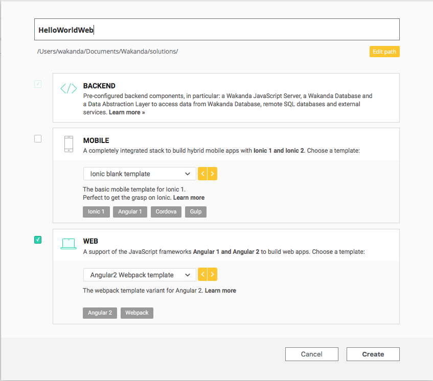
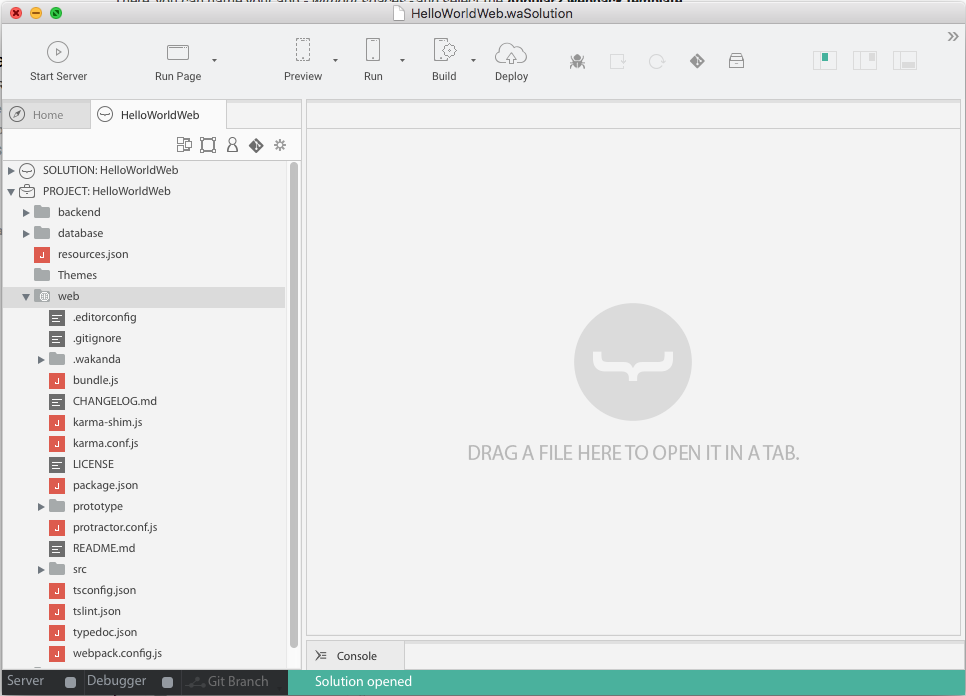
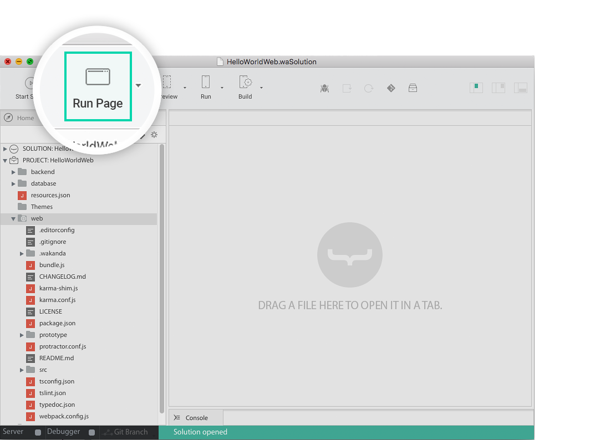
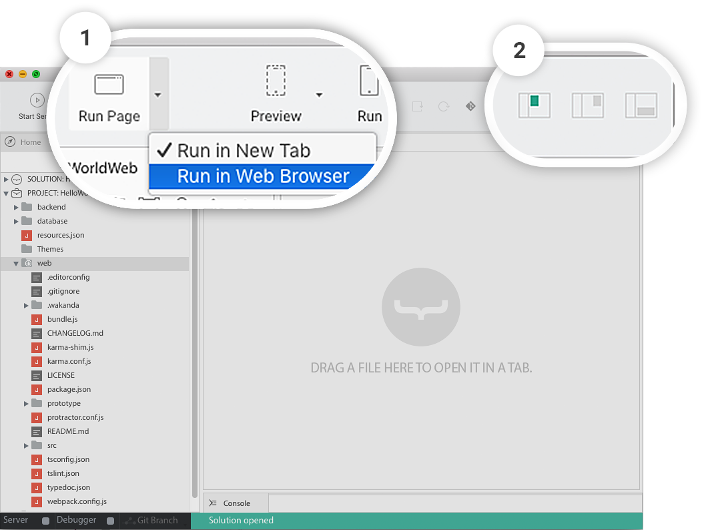
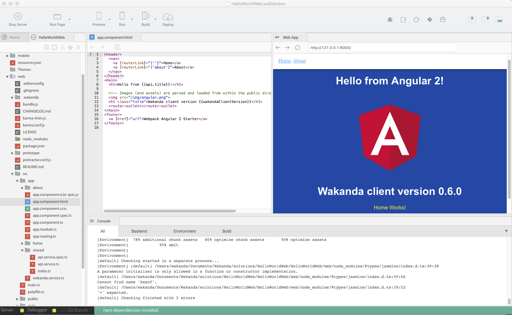
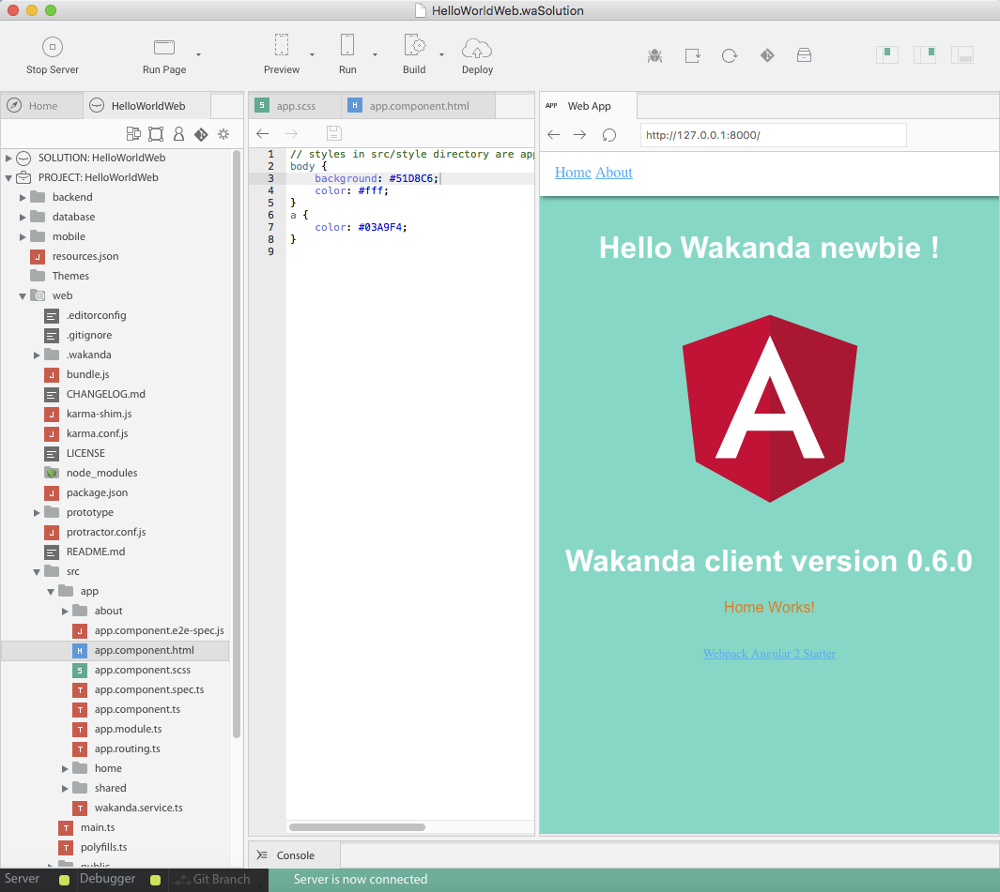

---
---

# Hello World: your first Web App with Angular2

## Step 1 : Install Wakanda

First, download and install **Wakanda Community Edition**

- On Windows, [x86](https://github.com/Wakanda/wakanda-digital-app-factory/releases/download/v1.1.3/wakanda-community-all_1.1.3_x86.msi "download") or [x64](https://github.com/Wakanda/wakanda-digital-app-factory/releases/download/v1.1.3/wakanda-community-all_1.1.3_x64.msi "download")
- On Mac OS X, [x64](https://github.com/Wakanda/wakanda-digital-app-factory/releases/download/v1.1.3/wakanda-community-all_1.1.3_x64.dmg "download")


Now we can start our **HelloWorldWeb** project.  

## Step 2: Choose : mobile or web app ?

We can choose the kind of app we want to create : mobile, web or both.

Here we want to create an *Angular2 web app*.

To do that, we're going to open the studio, (add studio icon here) and click on **"Create a new solution"**:


Which opens the template selection page:  




The structure of your future projects depends of the template you choose.

You'll always have the **same back end strcture**, but you can choose to have a **web front-end and/or mobile front-end**.

There, you can name your app *- without spaces -* and select the **Angular2 webpack template**.

Now, in your **HelloWorldWeb** project, you can find the Angular2 web app file structure :

  

You have 3 folders at the root of your project:

- **Backend**: Wakanda JavaScript Server. It contains all the Server files to logs, settings, permissions.  
- **Database**: Wakanda DB folder. It contains your data model(s), backups and your data.
- **Web**: where you’ll find all your web app front-end files. It contains all you need to code your Angular 1 or 2 projects.

> **TIPS**:  
> - If you choose web and mobile in the template selection, you'll have both a `mobile` and a `web`folder.
> - A mobile and a web front-end, for the same back-end.


**Note** : "prototyper" folder in the Web Project is a prototyper tool to create quickly Web UI based on widgets architecture. But it is deprecated and will be excluded from the platform in our next major release!

For our **HelloWorldWeb** we’re going to work first in the `web` folder.


## Step 3: Run your web application

First let's have a look to our web template.

Click on the _Run Page_ toolbar button:




> **TIPS**:  

> 1. To open your application in your default browser, set this preference via _Run Page_ dropdown
> 2. Customize the panels: open the right panel from the toolbar toggles
> 3. You can move the web preview on the right panel








## Step 4: Code your Angular2 application

Let's have a look to our project structure : the src folder is the classical Angular2 project structure. [More info here](https://angular.io/docs/ts/latest/cli-quickstart.html "Angular CLI").

A simple change in `web/src/app/app.component.html` and I have my **HelloWorld** done.

To make it more visual, you can change the background color in its scss file `web/src/app.scss`:

```css
body{
  background:#51D8C6
  color:#fff;
} 
```

The preview is automatically reloaded after each saving.




<div class="navigation-step">
  <a class="btn next-button" href="populate-database.html">Step 2: Populate your database <i class="icon-chevron-right"></i></a>
</div>

---


