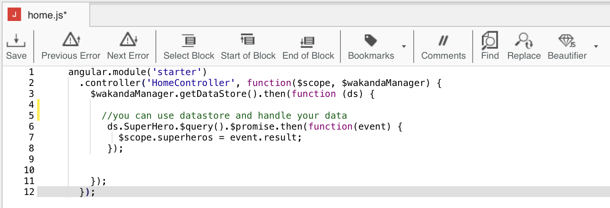
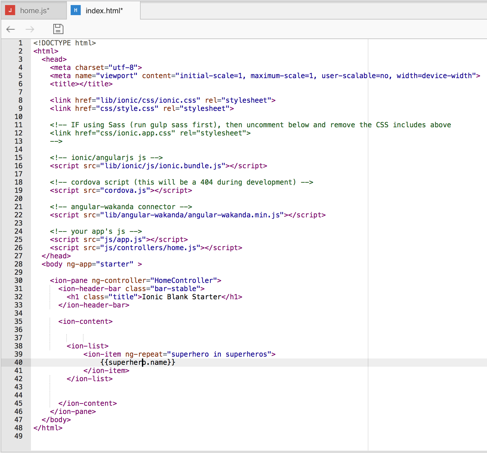
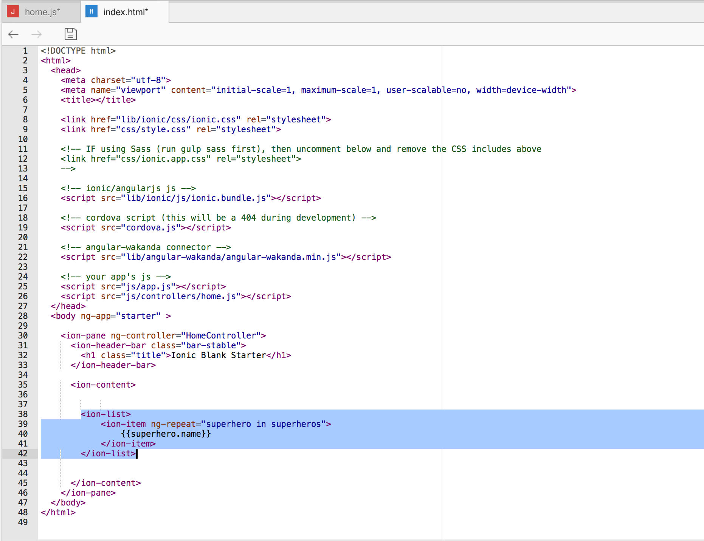
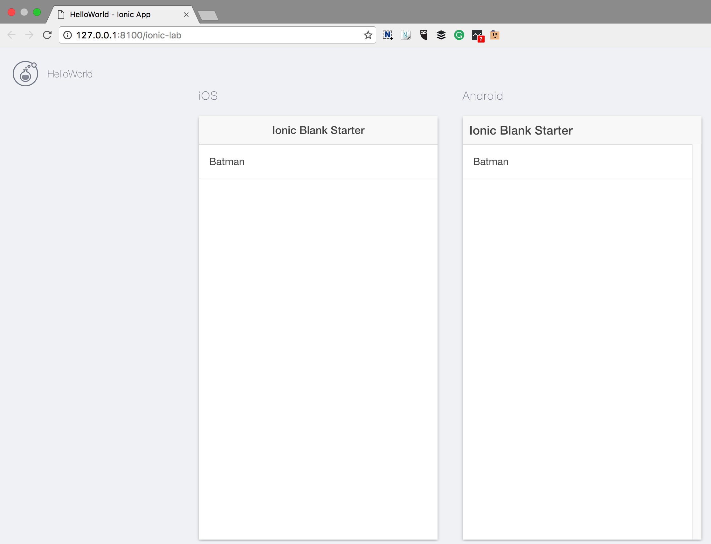
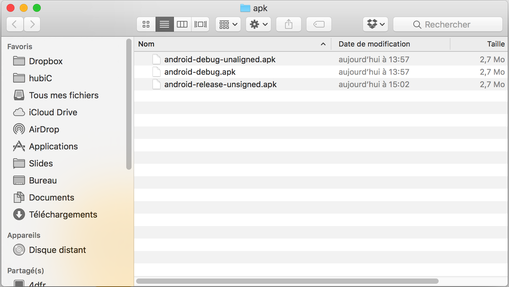

---
---

# Hello World: your first Mobile hybrid App

## Step 1: Install Wakanda

First, download and install **Wakanda Community Edition**

- On Windows, [x86](https://github.com/Wakanda/wakanda-digital-app-factory/releases/download/v1.1.3/wakanda-community-all_1.1.3_x86.msi "download") or [x64](https://github.com/Wakanda/wakanda-digital-app-factory/releases/download/v1.1.3/wakanda-community-all_1.1.3_x64.msi "download")
- On Mac OS X, [x64](https://github.com/Wakanda/wakanda-digital-app-factory/releases/download/v1.1.3/wakanda-community-all_1.1.3_x64.dmg "download")


Now we can start our **HelloWorld** project.  

## Step 2: Choose : mobile or web app ?
We can choose the kind of app we want to create : mobile, web or both.

Let’s say we want to create an *Android app with Ionic2*.

To do that, we're going to launch the studio  and click on **"Create a new solution"**:


Which opens the template selection page:  


The structure of your future projects depends of the template you choose.

You'll always have the **same back-end structure**, but you can choose to have a **web front-end and/or mobile front-end**.

There, you can name your app *- without spaces -* and select the **Ionic2 blank template**.

Now, in your **HelloWorld** project, you can find the basic Ionic2 file structure :

  

You have 3 folders at the root of your project:

- **Backend:** Wakanda JavaScript Server. It contains all the Server files to logs, settings, permissions.  
- **Database:** Wakanda DB folder. It contains your data model(s), backups and your data.
- **Mobile:** where you’ll find all your front-end files to develop and build your mobile app. It contains all you need to code your Ionic 1 or 2 projects.

> **TIPS**:  
> - If you choose both a mobile and web template, you have both a mobile and a web front-end file, for the same back-end.


For our **HelloWorld** we’re going to work first in the `mobile` folder.


## Step 3: Check for dependencies

Mobile apps are based on **AngularJS**, **Ionic** and **Cordova**.

For mobile apps, you need to check for any missing dependencies.
Go in the main menu  (_Help_ > _Wakanda Troubleshooting_) and choose Android.


Here you can see I miss Homebrew, Apache And and Android SDK. All is explained there: why I need them, and how to install them.


## Step 4: Code and preview  

Once all your dependencies are checked you can preview your app.

Just click on your project, and then on **"Preview"**.


Let's have a look to our project structure : the src folder is the classical ionic2 project structure. [More info here](http://ionicframework.com/docs/v2/setup/tutorial/project-structure/ "ionic tutorial").

A simple change in `mobile/src/pages/home.html` and I have my **HelloWorld** done.

To make it more visual, you can change the home page background color in its scss file `mobile/src/pages/home.scss` by adding:

```css
.scroll-content {
  background-color:#f0f8ff
} 
```

The preview is automatically reloaded after each saving.


> **TIPS**:  
> - You can select **"Preview in web browser"** if you prefer to see the result in your default browser.  


## Step 5: Run on emulator  

Now you can run your app on the [Android emulator](https://developer.android.com/studio/run/emulator.html "check documentation").


## Step 6: Run on device  


Make sure you have [USB debugging enabled](http://developer.android.com/tools/device.html).

Wakanda Studio automatically detects supported device connected to the USB port.
Open the _Run_ dropdown and select the device to run on:


## Populate the built-in DataBase

Now, let's make our **HelloWorld** app more interesting by accessing datas from the built-in DB.

What about saying "Hello !" to your favorite superheros ? Let's populate the database with them.


## Step 1: Edit you data model Visually

First, we're going to create our datamodel.

To manage your data easily and quickly, Wakanda provides a **Visual Data Editor**. 
It will allow you to create your classes, and their properties visually.


1 - Create a `Superhero` dataclass, give it the attribute `name` of type `string` and save.


A corresponding JSON file is automatically generated, and updated each time you save.

> **TIPS**:  
> - You can click on "source" button to see the JSON file generated


2 - Create a second class `Movie`, give it the attribute `superheros` of type `SuperheroCollection`

The link is automatically displayed in the model


### Step 2 : Generate data

Create a JS file `addSuperHeros.js`to populate your database (_File_ > _New_ > JS File).
 
Then, use the generated constructor `Superhero`to add your top 3 `Superhero` in the the built-in database (`ds`for datastore).

```javascript
var favoriteSuperheroes = [];
favoriteSuperheroes[0]= new ds.Superhero({name:"Batman"});
favoriteSuperheroes[1]= new ds.Superhero({name:"Wolverine"});
favoriteSuperheroes[2]= new ds.Superhero({name:"Wonder Woman"});

favoriteSuperheroes.save();
```
> **TIPS**:  
> - The constructors generated by the visual editor always take an object as argument (and not the attributes values, as a classical JS object constructor).
> - `save()` is a Wakanda method used to save in the datastore.

## Display the list of your top 3 superheros in your App via AngularJS

Wakanda's client connector provides a full integration of the backend to the frontend. Let's see how you can display your backend data directly and easily to your frontend.


1 - Acess the controller

As you can see in `web/index.html`, our blank template application is contained in an AngularJS module called "Starter".

```html
<!DOCTYPE html>
<html class="no-js" ng-app="Starter">
</html>
```

This "Starter" module, is discribed in `web/app/app.js`. Our Wakanda's client connector is injected there. 

```javascript
angular.module('Starter', ['wakanda'])
```

Its controllers are in the folder `web/app/controllers`.
Open its existing controller file `web/app/controllers/home.js`.


2 - Add the following code there to access the Datamodel and start manipulating the data.

```javascript
      ds.Superhero.$query().$promise.then(function(event) {
         $scope.favoriteSuperheroes = event.result;
       });
```


3 - Open index.html to display the data and customize it



4 - Add the following Ionic code to display the list

```html
    <ion-list>
  		<ion-item ng-repeat="superhero in favoriteSuperheroes">
   			{{superhero.name}}
  		</ion-item>
	</ion-list>
```




5 - Display the result on iOS and Android simulators



6 - Build your app in Android to install it on your phone




[Getting Started »](index.html){:class="btn"}
