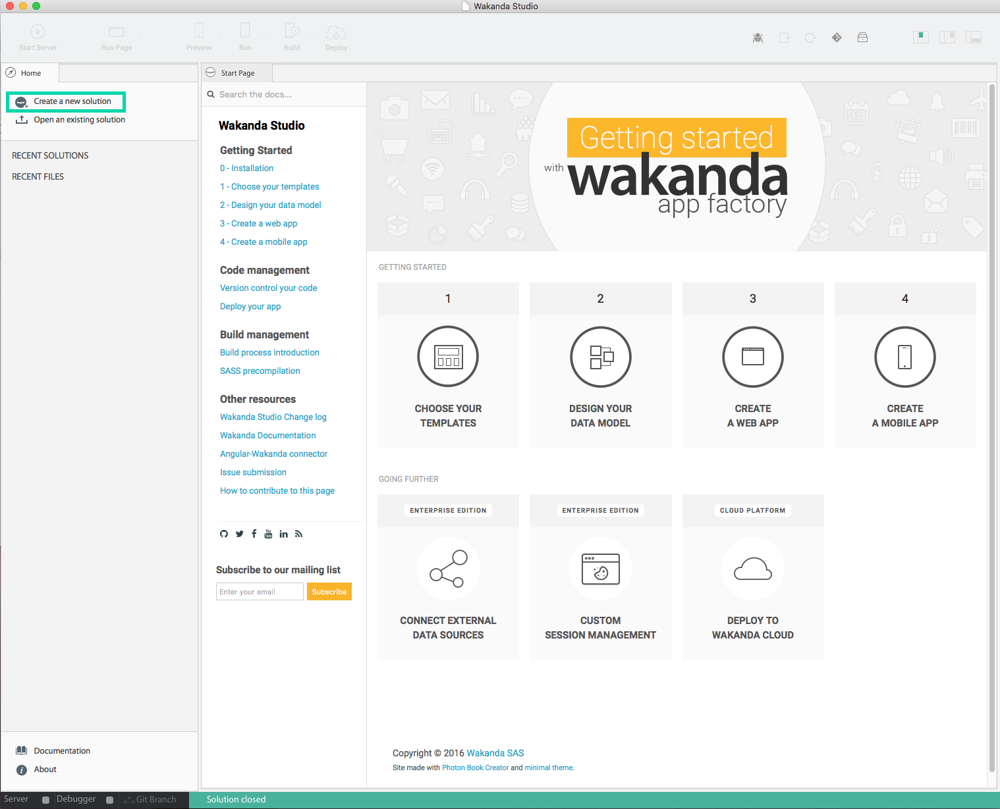
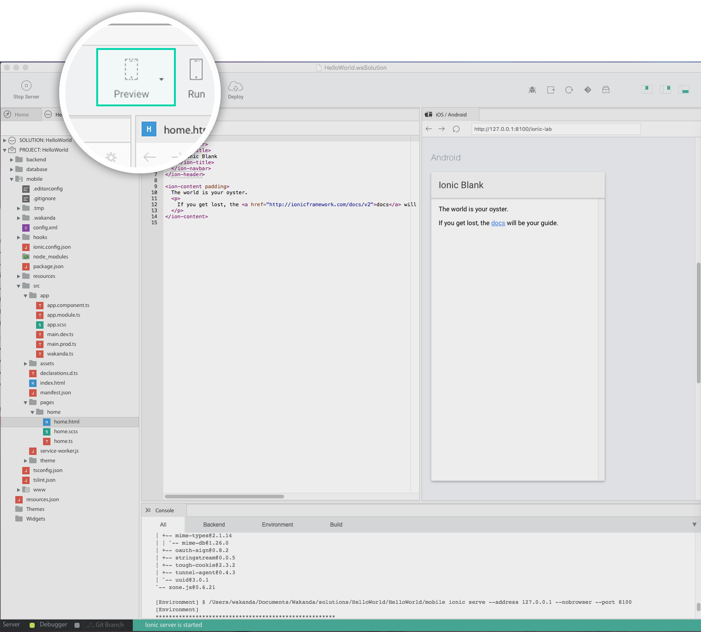
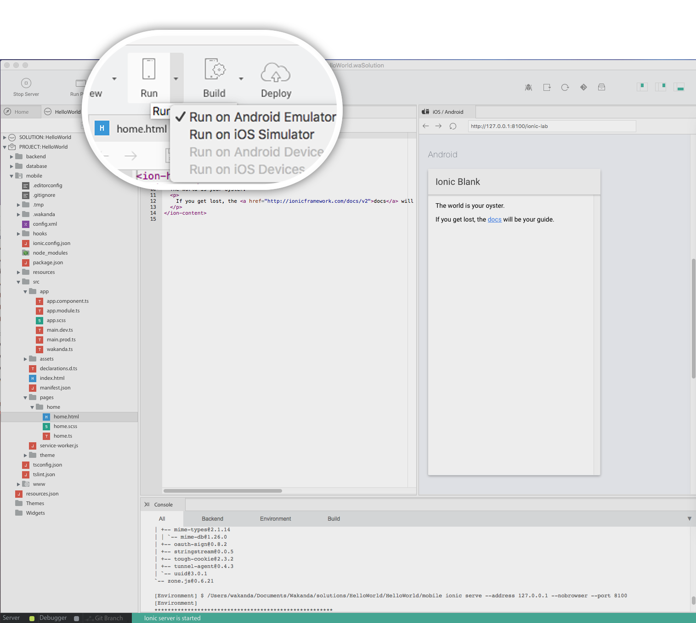
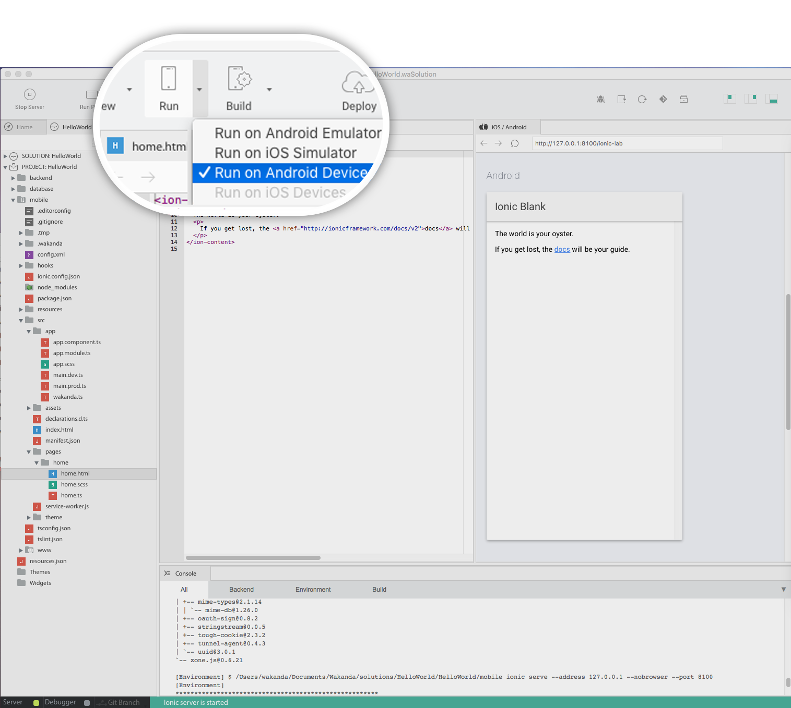

---
---

# Hello World: your first Mobile hybrid App

## Step 1: Install Wakanda

First, download and install **Wakanda Community Edition**

- On Windows, [x86](https://github.com/Wakanda/wakanda-digital-app-factory/releases/download/v1.1.3/wakanda-community-all_1.1.3_x86.msi "download") or [x64](https://github.com/Wakanda/wakanda-digital-app-factory/releases/download/v1.1.3/wakanda-community-all_1.1.3_x64.msi "download")
- On Mac OS X, [x64](https://github.com/Wakanda/wakanda-digital-app-factory/releases/download/v1.1.3/wakanda-community-all_1.1.3_x64.dmg "download")


Now we can start our **HelloWorld** project.  

## Step 2: Choose : mobile or web app ?
We can choose the kind of app we want to create : mobile, web or both.

Let’s say we want to create an *Android app with Ionic2*.

To do that, we're going to launch the studio  and click on **"Create a new solution"**:



Which opens the template selection page:  


The structure of your future projects depends of the template you choose.

You'll always have the **same back-end structure**, but you can choose to have a **web front-end and/or mobile front-end**.

There, you can name your app *- without spaces -* and select the **Ionic2 blank template**.

Now, in your **HelloWorld** project, you can find the basic Ionic2 file structure :

  

You have 3 folders at the root of your project:

- **Backend:** Wakanda JavaScript Server. It contains all the Server files to logs, settings, permissions.  
- **Database:** Wakanda DB folder. It contains your data model(s), backups and your data.
- **Mobile:** where you’ll find all your front-end files to develop and build your mobile app. It contains all you need to code your Ionic 1 or 2 projects.

> **TIPS**:  
> - If you choose both a mobile and web template, you have both a mobile and a web front-end file, for the same back-end.


For our **HelloWorld** we’re going to work first in the `mobile` folder.


## Step 3: Check for dependencies

Mobile apps are based on **AngularJS**, **Ionic** and **Cordova**.

For mobile apps, you need to check for any missing dependencies.
Go in the main menu  (_Help_ > _Wakanda Troubleshooting_) and choose Android.


Here you can see I miss Homebrew, Apache And and Android SDK. All is explained there: why I need them, and how to install them.


## Step 4: Code and preview  

Once all your dependencies are checked you can preview your app.

Just click on your project, and then on **"Preview"**.




Let's have a look to our project structure : the src folder is the classical ionic2 project structure. [More info here](http://ionicframework.com/docs/v2/setup/tutorial/project-structure/ "ionic tutorial").

A simple change in `mobile/src/pages/home.html` and I have my **HelloWorld** done.

To make it more visual, you can change the home page background color in its scss file `mobile/src/pages/home.scss` by adding:

```css
.scroll-content {
  background-color:#f0f8ff
} 
```

The preview is automatically reloaded after each saving.


> **TIPS**:  
> - You can select **"Preview in web browser"** if you prefer to see the result in your default browser.  


## Step 5: Run on emulator  

Now you can run your app on the [Android emulator](https://developer.android.com/studio/run/emulator.html "check documentation").




## Step 6: Run on device  


Make sure you have [USB debugging enabled](http://developer.android.com/tools/device.html).

Wakanda Studio automatically detects supported device connected to the USB port.
Open the _Run_ dropdown and select the device to run on:




[Go to step 2](index.html){:class="btn"}
