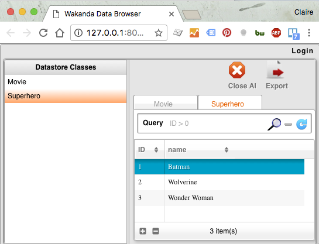

---
---

# Populate the built-in DataBase

Now, let's make our **HelloWorld** apps more interesting by accessing datas from the built-in DB.

What about saying "Hello !" to your favorite superheros ? Let's populate the database with them.


## Step 1: Edit you data model Visually

First, we're going to create our datamodel.

To manage your data easily and quickly, Wakanda provides a **Visual Data Editor**. 

It will allow you to create your classes, and their properties visually.


1 - Create a `Superhero` and a `Movie`dataclasses. 

Give them respectively the attribute `name` and `title` of type `string` and save.


> **TIPS**:  
> - The attribute `ID` is given by default to all dataclasses created. The classes instantiation are named "Entity" in Wakanda. 
> They are similar to classical js class instanciation, except a new ID is automatically at each generation in order to keep entities uniqueness in the datastore.

2 - Add an attribute `movie` to `Superhero`dataclass and give it the type `Movie`.
The relationship between the two classes is automatically displayed in the model


The JSON file of your datamodel is automatically updated each time you save.


> **TIPS**:  
> - You can click on "source" button to see the JSON file generated


## Step 2 : Generate data

Create a JS file `addSuperHeros.js` in the folder `database` to populate your database (Right click on the folder or _File_ > _New_ > JS File).
 
Then, use the generated constructor `Superhero`to add your top 3 `Superhero` in the the built-in database (`ds`for datastore).

```javascript
new ds.Superhero({name:"Batman"}).save();
new ds.Superhero({name:"Wolverine"}).save();
var favoriteSupehero = new ds.Superhero({name:"Wonder Woman"});
favoriteSupehero.save();
```
> **TIPS**:  
> - The constructors generated by the visual editor always take an object as argument (and not the attributes values, as a classical JS object constructor).
> - `save()` is a Wakanda method used to save the JSON corresponding to the Entity (meaning only it's attributes) in the datastore. 


> **WARNING**:  
> - The JSON saved are not related to the `var favoriteSuperhero` in the datastore, nor in your front-end calls.


Run your file. Then go to the databrowser to see the result in the main menu (Backend > Data Browser).

Your three favorite superheroes are now saved in the datastore !




<div class="navigation-step">
  <a class="btn next-button" href="display-data-in-webapp.html">Step 3: Display your data <i class="icon-chevron-right"></i></a>
</div>
